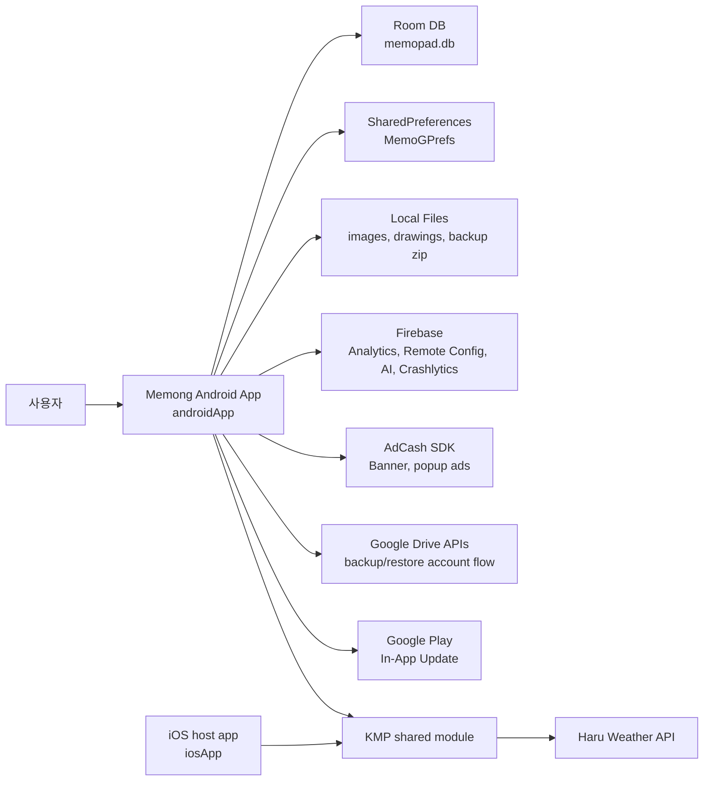
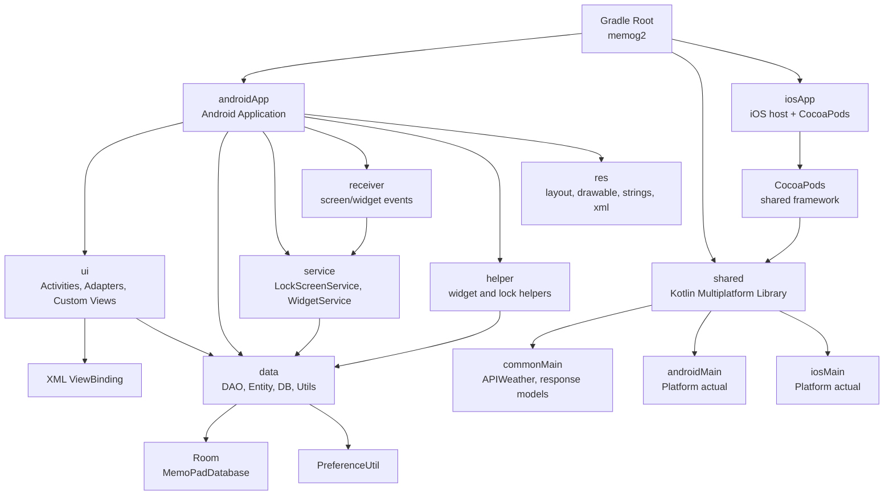
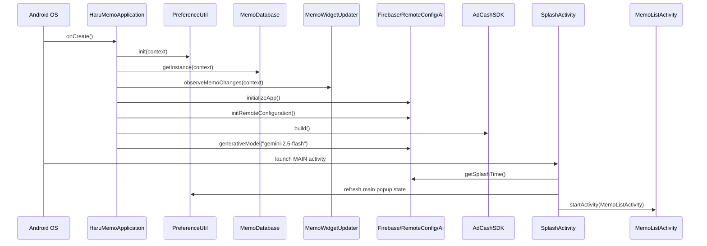
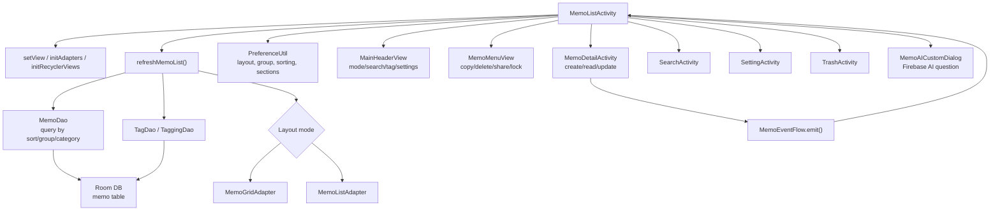
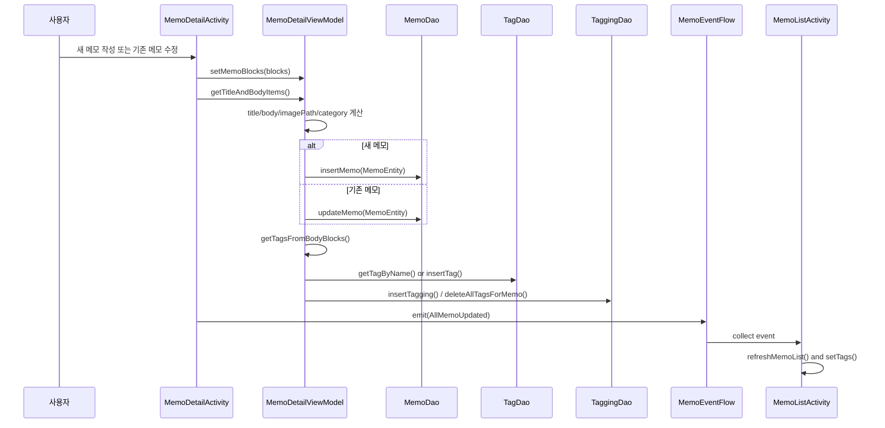
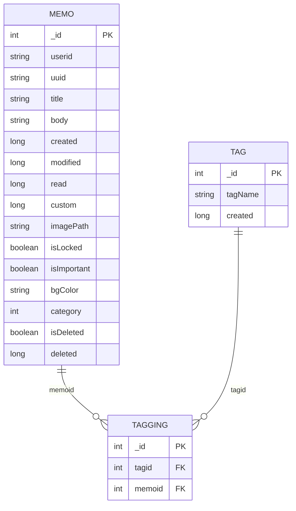
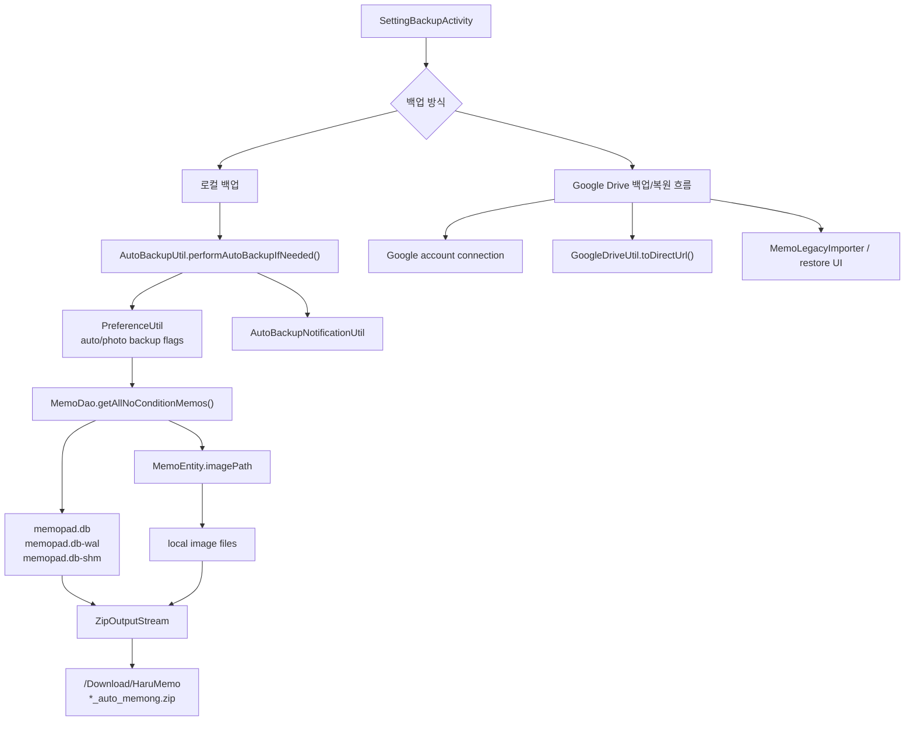
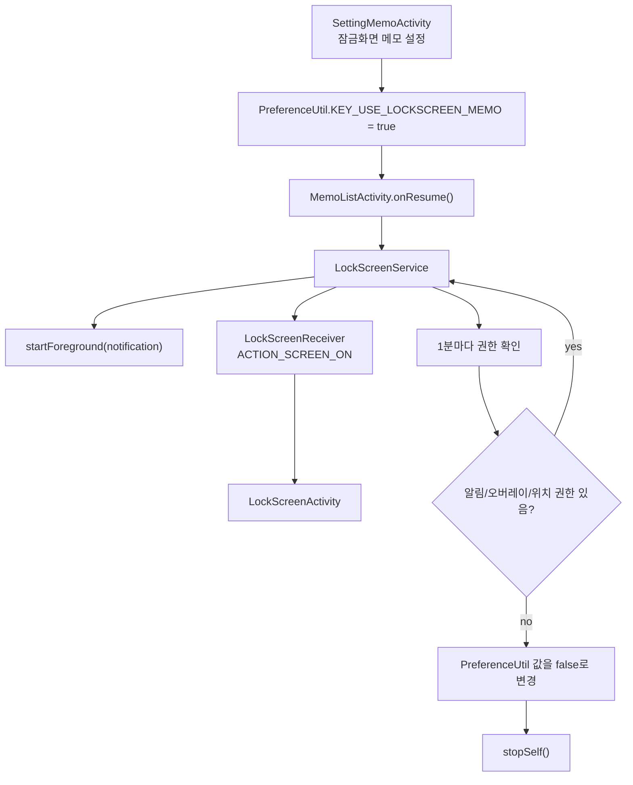
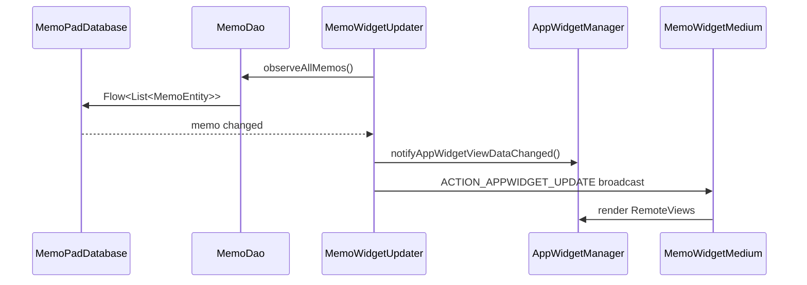
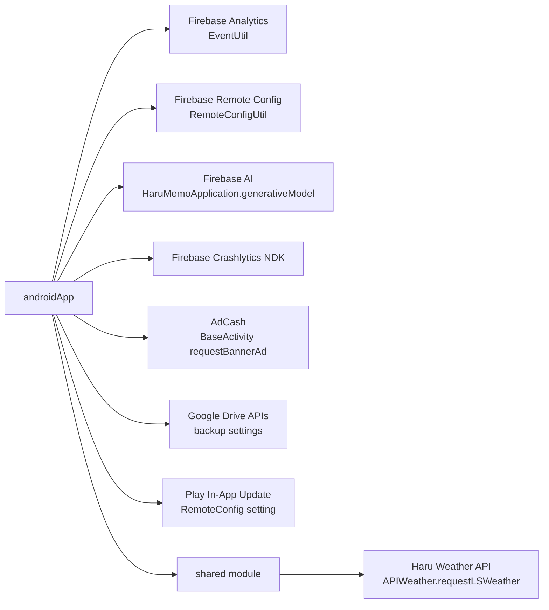

# Memong Architecture

이 문서는 메몽 앱의 내부 소스를 기준으로 전체 흐름과 아키텍처를 정리한 증빙용 자료입니다. 다이어그램은 Mermaid 형식이므로 GitHub, GitLab, Notion 일부 환경, Mermaid Live Editor 등에서 시각화할 수 있습니다.

## 1. 시스템 컨텍스트

메몽은 Android 앱을 중심으로 동작하며, KMP `shared` 모듈은 공통 네트워크 코드와 iOS framework 연결점을 제공합니다. 앱 내부 데이터는 Room DB와 SharedPreferences에 저장되고, Firebase/AdCash/Google Drive/날씨 API 등 외부 서비스와 연동합니다.

## 2. 모듈 아키텍처

Android 앱은 전통적인 Activity/ViewBinding 중심 구조입니다. 화면 로직은 `ui`, 저장소와 변환 로직은 `data`, 백그라운드 기능은 `service`/`receiver`/`helper`에 분리되어 있습니다.

## 3. 앱 시작 흐름

`HaruMemoApplication`에서 전역 SDK와 데이터 계층을 초기화한 뒤 `SplashActivity`를 거쳐 `MemoListActivity`로 진입합니다.

## 4. 메인 화면 흐름

`MemoListActivity`는 메모 목록의 허브입니다. Room에서 메모/태그를 읽고, 사용자의 화면 모드/정렬/섹션 상태는 `PreferenceUtil`에 저장합니다. 메모 변경 이벤트는 `MemoEventFlow`를 통해 목록과 태그 갱신으로 이어집니다.

## 5. 메모 작성/수정 시퀀스

메모 상세 화면은 `MemoDetailViewModel`이 `MemoBlock`을 `BodyItem`으로 변환하고, 이미지 포함 여부로 카테고리를 결정한 뒤 Room에 저장합니다. 본문에서 태그를 추출해 `tag`/`tagging` 테이블도 함께 갱신합니다.

## 6. 데이터 모델

Room DB는 `memo`, `tag`, `tagging` 세 테이블을 중심으로 구성됩니다. `memo.body`와 `memo.imagePath`는 TypeConverter를 통해 복합 데이터를 저장하는 구조입니다.

## 7. 백업/복원 흐름

백업은 설정 화면에서 수동으로 실행되거나, `AutoBackupUtil.performAutoBackupIfNeeded()`를 통해 자동으로 실행됩니다. 자동 백업은 DB 파일과 선택된 이미지 파일을 ZIP으로 묶어 다운로드 폴더 하위에 저장합니다.

## 8. 잠금화면 메모 흐름

잠금화면 메모는 foreground service와 screen-on receiver를 사용합니다. 권한이 사라지면 설정 값을 끄고 서비스를 종료합니다.

## 9. 위젯 갱신 흐름

위젯은 Room `Flow`를 직접 구독해 메모 변경을 감지합니다. 변경 발생 시 AppWidgetManager에 데이터 변경을 알리고, medium 위젯 receiver로 업데이트 intent를 보냅니다.

## 10. 외부 연동 맵

## 11. 소스 근거 맵

| 영역 | 대표 파일 |
| --- | --- |
| 앱 전역 초기화 | `androidApp/src/main/java/com/avatye/haru/memo/HaruMemoApplication.kt` |
| 시작 화면 | `androidApp/src/main/java/com/avatye/haru/memo/ui/SplashActivity.kt` |
| 메인 목록 | `androidApp/src/main/java/com/avatye/haru/memo/ui/MemoListActivity.kt` |
| 메모 상세/편집 | `androidApp/src/main/java/com/avatye/haru/memo/ui/MemoDetailActivity.kt` |
| 메모 편집 상태/저장 | `androidApp/src/main/java/com/avatye/haru/memo/ui/viewmodel/MemoDetailViewModel.kt` |
| Room DB | `androidApp/src/main/java/com/avatye/haru/memo/data/database/MemoPadDatabase.kt` |
| 메모 DAO | `androidApp/src/main/java/com/avatye/haru/memo/data/dao/MemoDao.kt` |
| 메모/태그 엔티티 | `androidApp/src/main/java/com/avatye/haru/memo/data/entity/` |
| 이벤트 플로우 | `androidApp/src/main/java/com/avatye/haru/memo/MemoEventFlow.kt` |
| 설정 저장 | `androidApp/src/main/java/com/avatye/haru/memo/data/utils/PreferenceUtil.kt` |
| Remote Config | `androidApp/src/main/java/com/avatye/haru/memo/data/utils/RemoteConfigUtil.kt` |
| 자동 백업 | `androidApp/src/main/java/com/avatye/haru/memo/data/utils/AutoBackupUtil.kt` |
| 잠금화면 서비스 | `androidApp/src/main/java/com/avatye/haru/memo/service/LockScreenService.kt` |
| 위젯 갱신 | `androidApp/src/main/java/com/avatye/haru/memo/helper/MemoWidgetUpdater.kt` |
| KMP 공통 날씨 API | `shared/src/commonMain/kotlin/com/avatye/haru/network/api/APIWeather.kt` |

## 12. 한 줄 요약

메몽은 `Activity + ViewBinding` 기반 Android 앱에 `Room` 로컬 저장소, `PreferenceUtil` 설정 저장소, `Firebase/AdCash/Google Drive` 외부 연동, `KMP shared` 공통 네트워크 모듈을 결합한 메모 애플리케이션입니다.
